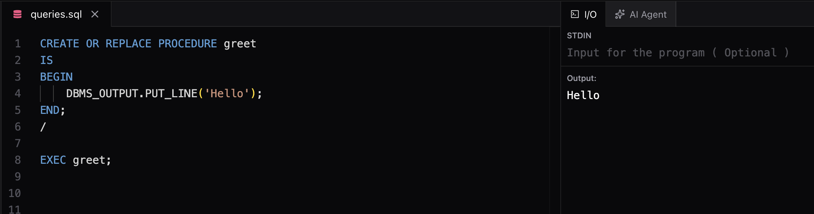
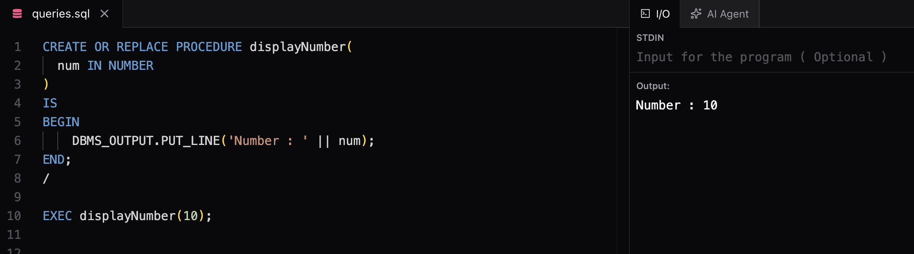
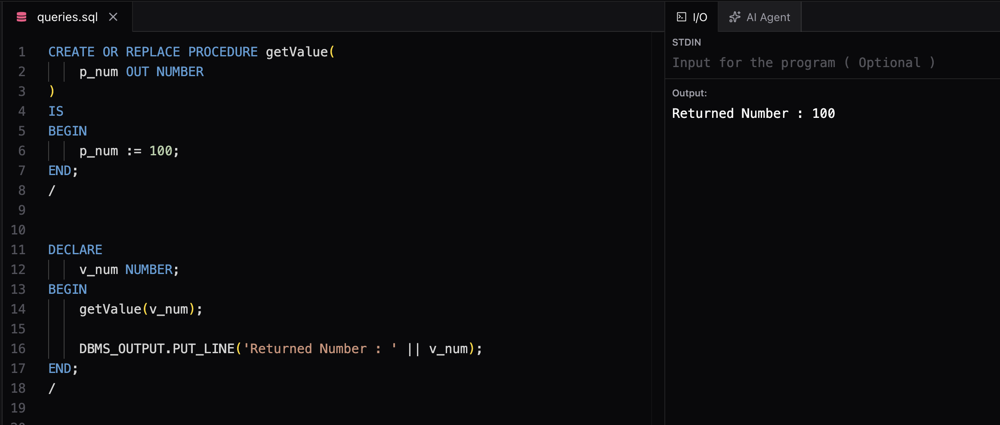
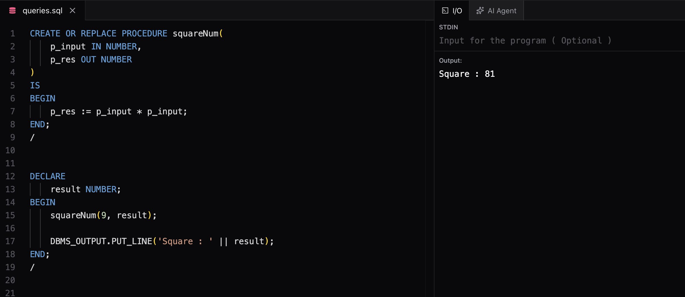

# Types of PL/SQL Blocks

PL/SQL blocks are of two types:

## 1. Anonymous Block
An anonymous block is a PL/SQL block that does not have a name.

### Characteristics
* No name is assigned.
* Not stored in the database.
* Executed only once.
* Mainly used for testing and small programs.

### Example

```sql
BEGIN
    DBMS_OUTPUT.PUT_LINE('Hello World');
END;
/
```

### Explanation
* `BEGIN` starts the executable section.
* `DBMS_OUTPUT.PUT_LINE()` prints output.
* `END` ends the block.
* `/` executes the block.

After execution, Oracle does not save this block anywhere.

---

## 2. Named Block

A named block is a PL/SQL block that has a name and is stored in the database.

### Characteristics
* Has a name.
* Stored in the database.
* Can be executed multiple times.
* Reusable.
* Used in real applications.

### Examples

* Procedures
* Functions
* Triggers
* Packages

### Example

```sql
CREATE OR REPLACE PROCEDURE greet
IS
BEGIN
    DBMS_OUTPUT.PUT_LINE('Hello World');
END;
/
```

### Executing the Procedure

```sql
EXEC greet;
```

### Output


### Explanation

* `greet` is the name of the procedure.
* Oracle stores it in the database.
* It can be called any number of times.

---

# Parameter Modes

When creating procedures or functions, parameters can be passed in three modes.

## 1. IN Parameter

Used to pass data into a procedure.

### Example

```sql
CREATE OR REPLACE PROCEDURE displayNumber(
    p_num IN NUMBER
)
IS
BEGIN
    DBMS_OUTPUT.PUT_LINE(p_num);
END;
/
```

Execution:

```sql
EXEC displayNumber(10);
```

Flow:

```text
10 ---> Procedure
```

### Output


---

## 2. OUT Parameter

Used to return data from a procedure.

### Example

```sql
CREATE OR REPLACE PROCEDURE getValue(
    p_num OUT NUMBER
)
IS
BEGIN
    p_num := 100;
END;
/
```

Execution:

```sql
DECLARE
    v_num NUMBER;
BEGIN
    getValue(v_num);

    DBMS_OUTPUT.PUT_LINE('Returned Number : ' || v_num);
END;
/
```

Flow:

```text
Procedure ---> 100
```

### Output


---

## 3. IN OUT Parameter

Used when a parameter is both input and output.

### Example

```sql
CREATE OR REPLACE PROCEDURE squareNum(
    p_input IN NUMBER,
    p_res OUT NUMBER
)
IS
BEGIN
    p_res := p_input * p_input;
END;
/
```

Execution:

```sql
DECLARE
    result NUMBER;
BEGIN
    squareNum(9, result);

    DBMS_OUTPUT.PUT_LINE('Square : ' || result);
END;
/
```

Flow:

```text
10 ---> Procedure ---> 20
```

### Output


---

# Quick Revision

| Type            | Description            |
| --------------- | ---------------------- |
| Anonymous Block | No name, executed once |
| Named Block     | Stored and reusable    |
| IN              | Input only             |
| OUT             | Output only            |
| IN OUT          | Input and output       |

# My Notes

* Anonymous blocks are mainly used for testing.
* Named blocks are used in real applications.
* Procedures and Functions are examples of named blocks.
* IN passes values to a procedure.
* OUT returns values from a procedure.
* IN OUT both receives and returns values.
