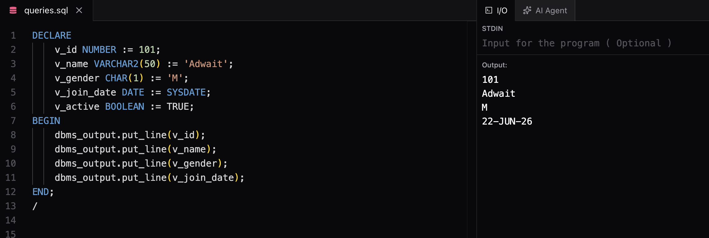

# Basic PL/SQL Syntax

## Statement Terminator (;)

Every PL/SQL statement ends with a semicolon (`;`).

Example:

```sql
DECLARE
    v_num NUMBER := 10;
BEGIN
    DBMS_OUTPUT.PUT_LINE(v_num);
END;
/
```

---

## Block Execution (/)

A slash (`/`) is used to execute a PL/SQL block.

Example:

```sql
BEGIN
    DBMS_OUTPUT.PUT_LINE('Hello');
END;
/
```

Without `/`, Oracle compiles the block but does not execute it.

---

## Variable Initialization

Variables can be initialized while declaring them.

Using `:=`

```sql
DECLARE
    v_num NUMBER := 100;
BEGIN
    DBMS_OUTPUT.PUT_LINE(v_num);
END;
/
```

Using `DEFAULT`

```sql
DECLARE
    v_num NUMBER DEFAULT 100;
BEGIN
    DBMS_OUTPUT.PUT_LINE(v_num);
END;
/
```

---

## Default Value of Variables

If a variable is not initialized, Oracle automatically assigns it `NULL`.

Example:

```sql
DECLARE
    v_num NUMBER;
BEGIN
    IF v_num IS NULL THEN
        DBMS_OUTPUT.PUT_LINE('Variable is NULL');
    END IF;
END;
/
```

Output:

```text
Variable is NULL
```

---

## NULL Statement

`NULL` is a valid PL/SQL statement that performs no action.

Example:

```sql
BEGIN
    NULL;
END;
/
```

### Uses

- Placeholder for future code
- Empty IF or LOOP blocks
- Intentionally doing nothing

Example:

```sql
DECLARE
    v_age NUMBER := 15;
BEGIN
    IF v_age >= 18 THEN
        DBMS_OUTPUT.PUT_LINE('Eligible');
    ELSE
        NULL;
    END IF;
END;
/
```

---

## Nested Blocks

A PL/SQL block can contain another PL/SQL block.

Example:

```sql
DECLARE
    v_num NUMBER := 10;
BEGIN
    DECLARE
        v_name VARCHAR2(20) := 'Adwait';
    BEGIN
        DBMS_OUTPUT.PUT_LINE(v_name);
    END;
END;
/
```

# Common PL/SQL Data Types

| Data Type | Purpose |
|------------|----------|
| NUMBER | Stores numeric values |
| VARCHAR2(n) | Stores variable-length strings |
| CHAR(n) | Stores fixed-length strings |
| DATE | Stores date and time |
| BOOLEAN | Stores TRUE/FALSE values |



## Notes

- Variables declared inside a nested block are not accessible outside it.
- Outer block variables can be accessed inside inner blocks.
- NUMBER is the most commonly used numeric type.
- VARCHAR2 is the preferred string type in Oracle.
- DATE stores both date and time.
- BOOLEAN can be used in PL/SQL variables but not in table columns.

---

## Quick Revision

| Concept | Purpose |
|----------|---------|
| ; | Ends a PL/SQL statement |
| / | Executes a PL/SQL block |
| := | Assigns value to a variable |
| DEFAULT | Alternative way to initialize variables |
| NULL | Do nothing statement |
| Nested Block | Block inside another block |
| Uninitialized Variable | Gets NULL by default |

---

