# Control Structures

Control structures determine the flow of execution of a PL/SQL program.

## Types of Control Structures

### 1. Conditional Statements

* IF
* CASE

### 2. Loop Statements

* LOOP
* WHILE LOOP
* FOR LOOP

### 3. Loop Control Statements

* EXIT
* EXIT WHEN
* CONTINUE
* CONTINUE WHEN

---

# IF Statement

Used to execute statements based on a condition.

## IF THEN

```sql
DECLARE
    age NUMBER := 20;
BEGIN
    IF age >= 18 THEN
        DBMS_OUTPUT.PUT_LINE('Eligible');
    END IF;
END;
/
```
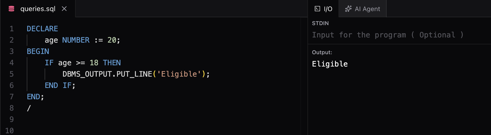

---

## IF THEN ELSE

```sql
DECLARE
    age NUMBER := 16;
BEGIN
    IF age >= 18 THEN
        DBMS_OUTPUT.PUT_LINE('Eligible');
    ELSE
        DBMS_OUTPUT.PUT_LINE('Not Eligible');
    END IF;
END;
/
```
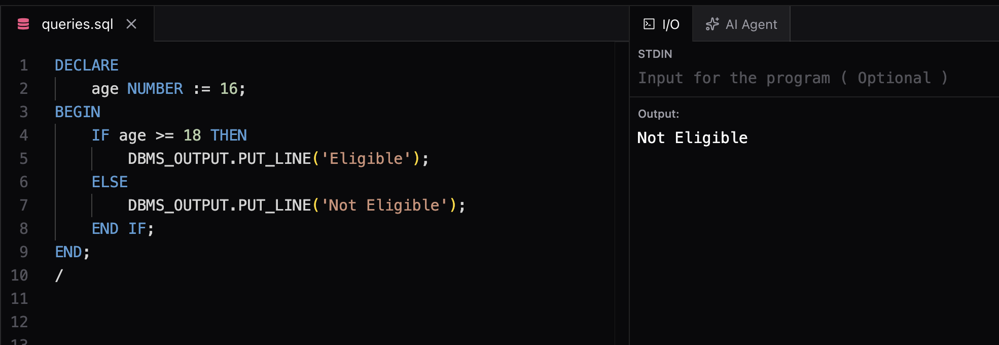

---

## IF THEN ELSIF

```sql
DECLARE
    marks NUMBER := 75;
BEGIN
    IF marks >= 90 THEN
        DBMS_OUTPUT.PUT_LINE('Grade A');
    ELSIF marks >= 70 THEN
        DBMS_OUTPUT.PUT_LINE('Grade B');
    ELSE
        DBMS_OUTPUT.PUT_LINE('Grade C');
    END IF;
END;
/
```

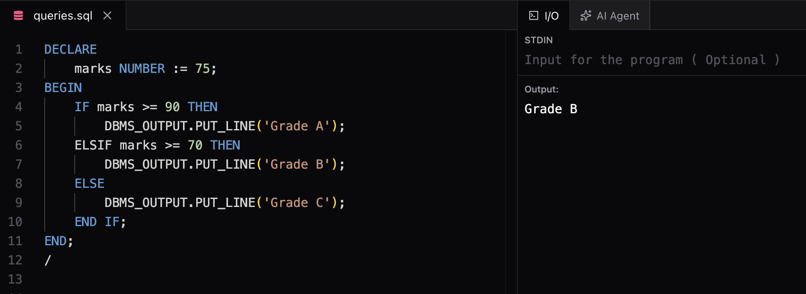

---

# CASE Statement

Used when there are multiple conditions.

## Simple CASE

```sql
DECLARE
    grade CHAR(1) := 'A';
BEGIN
    CASE grade
        WHEN 'A' THEN
            DBMS_OUTPUT.PUT_LINE('Excellent');
        WHEN 'B' THEN
            DBMS_OUTPUT.PUT_LINE('Good');
        ELSE
            DBMS_OUTPUT.PUT_LINE('Average');
    END CASE;
END;
/
```

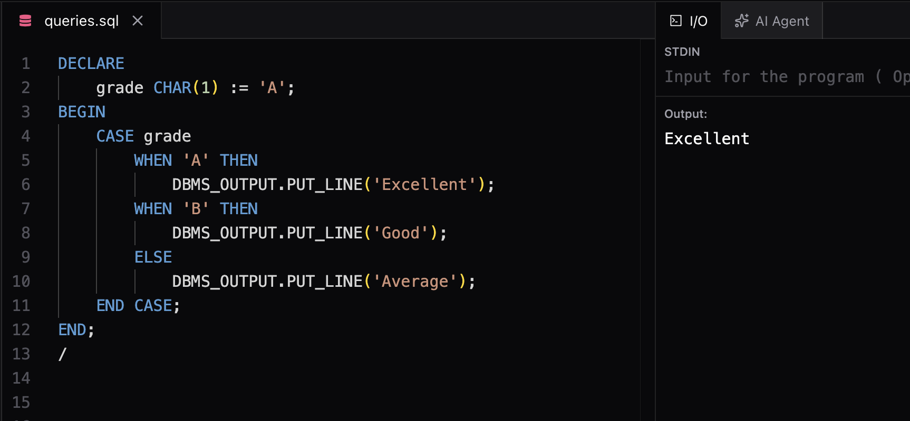


---

## Searched CASE

```sql
DECLARE
    marks NUMBER := 85;
BEGIN
    CASE
        WHEN marks >= 90 THEN
            DBMS_OUTPUT.PUT_LINE('Grade A');
        WHEN marks >= 70 THEN
            DBMS_OUTPUT.PUT_LINE('Grade B');
        ELSE
            DBMS_OUTPUT.PUT_LINE('Grade C');
    END CASE;
END;
/
```

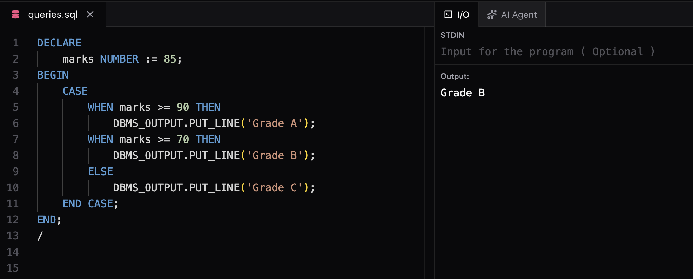

---

# LOOP

Basic loop that runs until explicitly stopped.

```sql
DECLARE
    counter NUMBER := 1;
BEGIN
    LOOP
        DBMS_OUTPUT.PUT_LINE(counter);

        EXIT WHEN counter = 5;

        counter := counter + 1;
    END LOOP;
END;
/
```

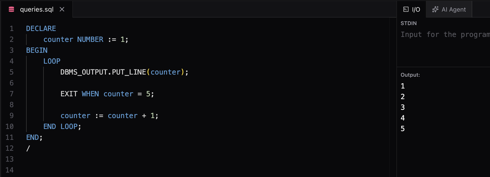

---

# WHILE LOOP

Runs while the condition remains TRUE.

```sql
DECLARE
    counter NUMBER := 1;
BEGIN
    WHILE counter <= 5 LOOP
        DBMS_OUTPUT.PUT_LINE('Iteration : ' || counter);
        counter := counter + 1;
    END LOOP;
END;
/
```

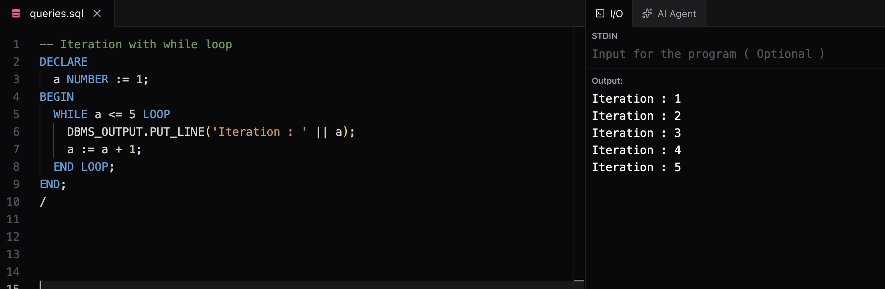

---

# FOR LOOP

Used when the number of iterations is known.

```sql
BEGIN
    FOR i IN 1..5 LOOP
        DBMS_OUTPUT.PUT_LINE('Iteration : ' || i);
    END LOOP;
END;
/
```

Output:

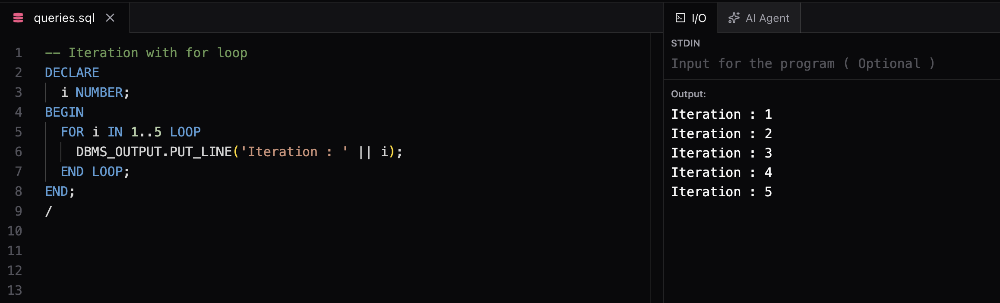

---

## REVERSE FOR LOOP

```sql
BEGIN
    FOR i IN REVERSE 1..5 LOOP
        DBMS_OUTPUT.PUT_LINE(i);
    END LOOP;
END;
/
```

Output:

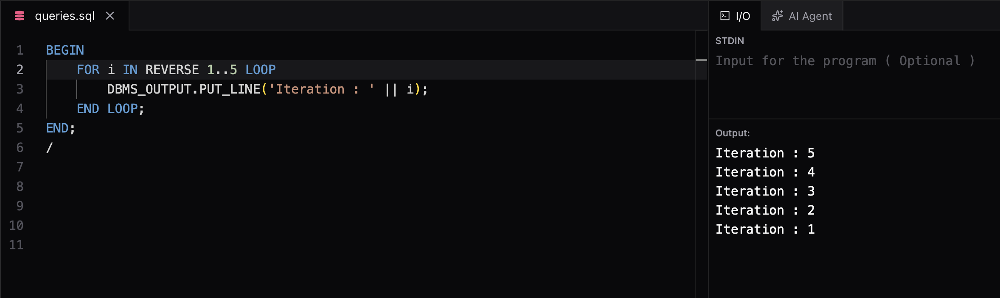

---

# EXIT Statement

Terminates a loop immediately.

```sql
DECLARE
    i NUMBER := 1;
BEGIN
    LOOP
        EXIT WHEN i > 5;

        DBMS_OUTPUT.PUT_LINE(i);

        i := i + 1;
    END LOOP;
END;
/
```

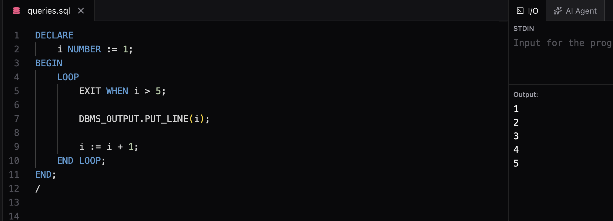

---

# CONTINUE Statement

Skips the current iteration and moves to the next iteration.

```sql
BEGIN
    FOR i IN 1..5 LOOP

        CONTINUE WHEN i = 3;

        DBMS_OUTPUT.PUT_LINE(i);

    END LOOP;
END;
/
```

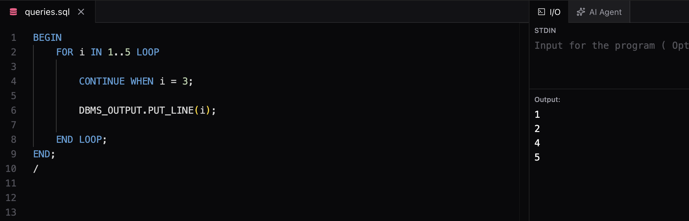

---

# Quick Revision

| Structure  | Purpose                           |
| ---------- | --------------------------------- |
| IF         | Execute code based on a condition |
| CASE       | Multiple condition checks         |
| LOOP       | Infinite loop until EXIT          |
| WHILE LOOP | Runs while condition is TRUE      |
| FOR LOOP   | Fixed number of iterations        |
| EXIT       | Terminates loop                   |
| CONTINUE   | Skips current iteration           |

---

# My Notes

* IF is used for decision making.
* CASE is cleaner when multiple conditions exist.
* FOR LOOP is preferred when iteration count is known.
* WHILE LOOP is preferred when iteration count is unknown.
* LOOP requires EXIT or EXIT WHEN to stop.
* CONTINUE skips the current iteration.
* Control structures are heavily used in Procedures, Functions, Triggers, and Cursors.
