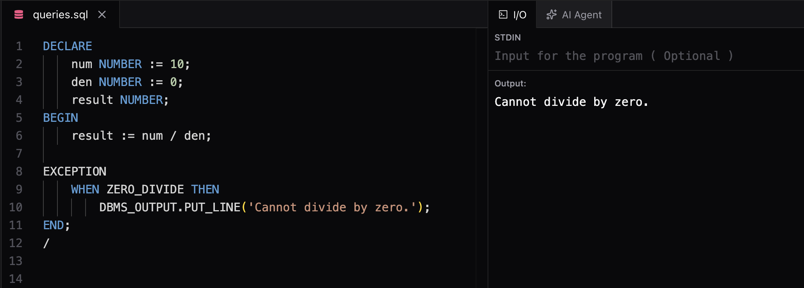
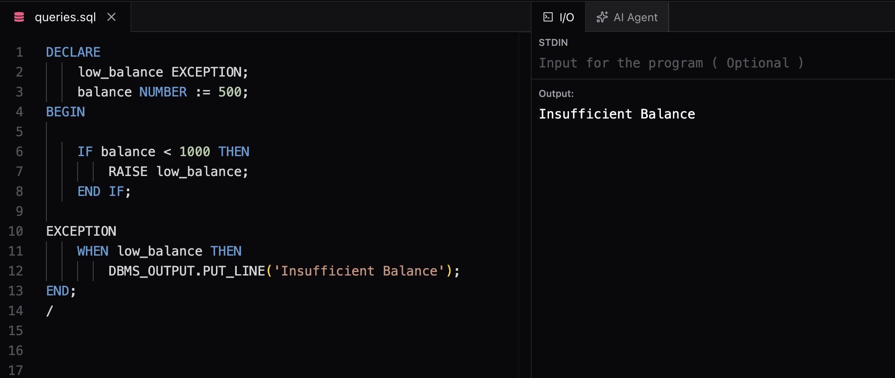
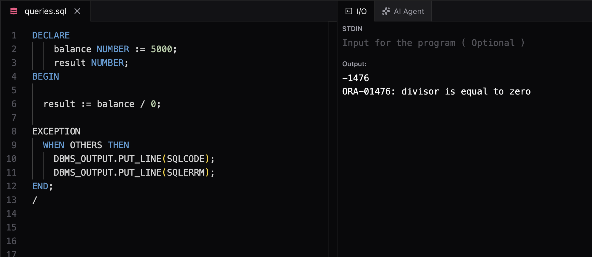

# Exception Handling

## What is an Exception?
An exception is a runtime error or warning that interrupts the normal execution of a PL/SQL program.

Examples:

* Division by zero
* No data found
* Too many rows returned
* Invalid number conversion

When an exception occurs:

1. Normal execution stops.
2. Control transfers to the `EXCEPTION` section.
3. The appropriate exception handler is executed.

---

# PL/SQL Block with Exception Handling

```sql
DECLARE
    -- Variable declarations
BEGIN
    -- Executable statements

EXCEPTION
    -- Exception handlers

END;
/
```

* `EXCEPTION` block is optional.
* It is executed only if an error occurs.

---

# Types of Exceptions

## 1. Predefined Exceptions

Built-in exceptions automatically raised by Oracle.

Common predefined exceptions:

| Exception        | Cause                              |
| ---------------- | ---------------------------------- |
| NO_DATA_FOUND    | SELECT INTO returns no rows        |
| TOO_MANY_ROWS    | SELECT INTO returns multiple rows  |
| ZERO_DIVIDE      | Division by zero                   |
| DUP_VAL_ON_INDEX | Duplicate value in a unique column |
| INVALID_NUMBER   | Invalid number conversion          |
| VALUE_ERROR      | Arithmetic or conversion error     |
| STORAGE_ERROR    | Memory error                       |

---

## 2. User-Defined Exceptions

Exceptions created by us.

Syntax:

```sql
DECLARE
    invalid_age EXCEPTION;
BEGIN
    ...
END;
/
```

Raise the exception:

```sql
RAISE invalid_age;
```

---

# Handling Exceptions

Syntax:

```sql
EXCEPTION
    WHEN exception_name THEN
        -- Handle exception
```

Example:

```sql
DECLARE
    num NUMBER := 10;
    den NUMBER := 0;
    result NUMBER;
BEGIN
    result := num / den;

EXCEPTION
    WHEN ZERO_DIVIDE THEN
        DBMS_OUTPUT.PUT_LINE('Cannot divide by zero.');
END;
/
```

Output:



---

# Multiple Exception Handlers

```sql
EXCEPTION
    WHEN NO_DATA_FOUND THEN
        DBMS_OUTPUT.PUT_LINE('No record found.');

    WHEN TOO_MANY_ROWS THEN
        DBMS_OUTPUT.PUT_LINE('More than one record found.');

    WHEN ZERO_DIVIDE THEN
        DBMS_OUTPUT.PUT_LINE('Division by zero.');
```

Oracle executes only the first matching handler.

---

# OTHERS Exception

`OTHERS` catches every exception that is not handled explicitly.

Example:

```sql
EXCEPTION
    WHEN OTHERS THEN
        DBMS_OUTPUT.PUT_LINE('Some error occurred.');
```

* Always place `OTHERS` last.
* It acts like a default case.

---

# Raising User-Defined Exceptions

```sql
DECLARE
    low_balance EXCEPTION;
    balance NUMBER := 500;
BEGIN

    IF balance < 1000 THEN
        RAISE low_balance;
    END IF;

EXCEPTION
    WHEN low_balance THEN
        DBMS_OUTPUT.PUT_LINE('Insufficient Balance');
END;
/
```



---

# SQLCODE and SQLERRM

Useful inside the `OTHERS` handler.

* `SQLCODE` → Returns the Oracle error number.
* `SQLERRM` → Returns the Oracle error message.

Example:

```sql
DECLARE
    balance NUMBER := 5000;
    result NUMBER;
BEGIN

  result := balance / 0;

EXCEPTION
  WHEN OTHERS THEN
    DBMS_OUTPUT.PUT_LINE(SQLCODE);
    DBMS_OUTPUT.PUT_LINE(SQLERRM);
END;
/
```



---

# Best Practices

* Handle expected exceptions explicitly.
* Use `OTHERS` only for unexpected errors.
* Keep exception handling separate from business logic.
* Use meaningful messages for debugging.
* Use user-defined exceptions for business rules.

---

# Quick Revision

| Keyword   | Purpose                          |
| --------- | -------------------------------- |
| EXCEPTION | Starts exception handling block  |
| WHEN      | Handles a specific exception     |
| OTHERS    | Handles all remaining exceptions |
| RAISE     | Raises a user-defined exception  |
| SQLCODE   | Returns error number             |
| SQLERRM   | Returns error message            |

---

# Questions

### What is an exception?

A runtime error that interrupts normal program execution.

### What are the types of exceptions?

* Predefined Exceptions
* User-Defined Exceptions

### What is the purpose of the EXCEPTION block?

To handle runtime errors.

### What is OTHERS?

A default handler that catches all unhandled exceptions.

### What is the difference between SQLCODE and SQLERRM?

* `SQLCODE` → Error number
* `SQLERRM` → Error message

### How do you create your own exception?

Declare it using the `EXCEPTION` keyword and raise it using the `RAISE` statement.
