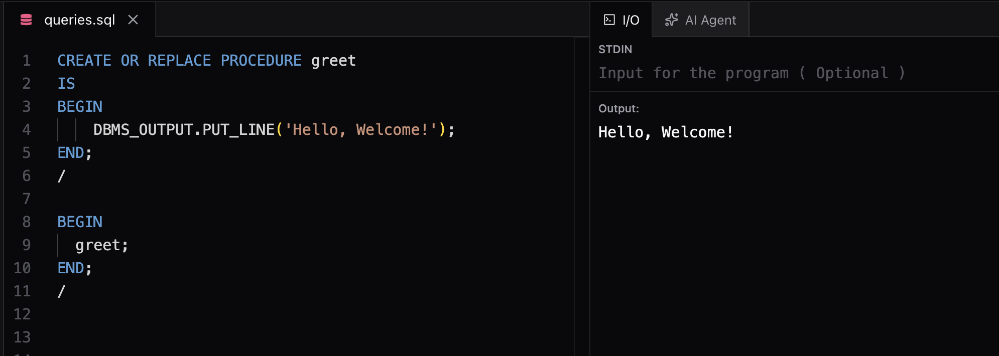
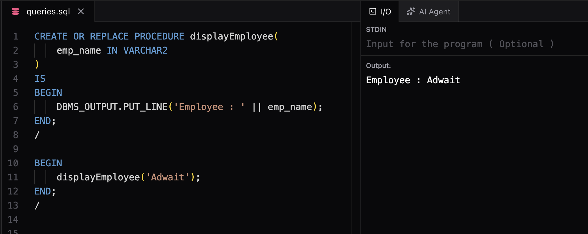
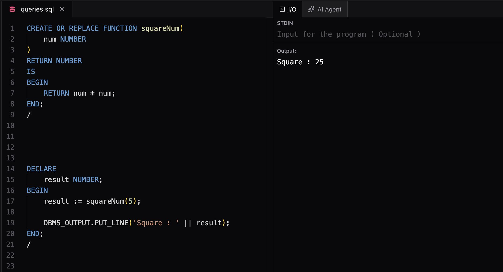

# Procedures and Functions in PL/SQL

## What are Procedures and Functions?

Procedures and Functions are **named PL/SQL blocks** stored in the database.

They allow you to write reusable business logic that can be executed multiple times.

---

# Procedure vs Function

| Procedure                                      | Function                                                                    |
| ---------------------------------------------- | --------------------------------------------------------------------------- |
| Performs a task                                | Performs a task and returns a value                                         |
| Return value is optional                       | Must return exactly one value                                               |
| Called using `EXEC`, `CALL`, or a PL/SQL block | Called inside an expression or assigned to a variable                       |
| Can have `IN`, `OUT`, and `IN OUT` parameters  | Can also have `IN`, `OUT`, and `IN OUT` parameters, but must return a value |

---

# Creating a Procedure

Syntax:

```sql
CREATE OR REPLACE PROCEDURE procedure_name
(
    parameter_name IN/OUT datatype
)
IS
BEGIN
    -- statements
END;
/
```

Example:

```sql
CREATE OR REPLACE PROCEDURE greet
IS
BEGIN
    DBMS_OUTPUT.PUT_LINE('Hello, Welcome!');
END;
/
```

Execute:

```sql
BEGIN
    greet;
END;
/
```



---

# Procedure with Parameters

```sql
CREATE OR REPLACE PROCEDURE displayEmployee(
    emp_name IN VARCHAR2
)
IS
BEGIN
    DBMS_OUTPUT.PUT_LINE('Employee: ' || emp_name);
END;
/
```

Call:

```sql
BEGIN
    displayEmployee('Adwait');
END;
/
```



---

# Creating a Function

Syntax:

```sql
CREATE OR REPLACE FUNCTION function_name
(
    parameter_name datatype
)
RETURN datatype
IS
BEGIN
    RETURN value;
END;
/
```

Example:

```sql
CREATE OR REPLACE FUNCTION squareNum(
    num NUMBER
)
RETURN NUMBER
IS
BEGIN
    RETURN num * num;
END;
/
```

Calling a Function:

```sql
DECLARE
    result NUMBER;
BEGIN
    result := squareNum(5);

    DBMS_OUTPUT.PUT_LINE(result);
END;
/
```

Output:



---

# Procedure Example

Increase employee salary.

```sql
CREATE OR REPLACE PROCEDURE increaseSalary(
    emp_id IN NUMBER,
    increment IN NUMBER
)
IS
BEGIN
    UPDATE Employees
    SET Salary = Salary + increment
    WHERE EmployeeID = emp_id;

    COMMIT;
END;
/
```

---

# Function Example

Calculate customer age.

```sql
CREATE OR REPLACE FUNCTION calculateAge(
    dob DATE
)
RETURN NUMBER
IS
BEGIN
    RETURN TRUNC(MONTHS_BETWEEN(SYSDATE, dob) / 12);
END;
/
```

---

# Parameter Modes

## IN

* Default parameter mode.
* Used to pass values into a procedure or function.
* Read-only inside the subprogram.

Example:

```sql
p_salary IN NUMBER
```

---

## OUT

* Used to return values to the caller.
* Must pass a variable while calling.

Example:

```sql
p_result OUT NUMBER
```

---

## IN OUT

* Used for both input and output.
* Receives a value, modifies it, and returns it.

Example:

```sql
p_balance IN OUT NUMBER
```

---

# CREATE OR REPLACE

```sql
CREATE OR REPLACE PROCEDURE greet
```

* Creates a new procedure if it does not exist.
* Replaces the existing procedure if it already exists.

This avoids dropping and recreating the procedure.

---

# Executing Procedures and Functions

## Procedure

```sql
BEGIN
    procedure_name(arguments);
END;
/
```

or

```sql
CALL procedure_name(arguments);
```

## Function

```sql
DECLARE
    result NUMBER;
BEGIN
    result := function_name(arguments);

    DBMS_OUTPUT.PUT_LINE(result);
END;
/
```

---

# When to Use

### Use a Procedure when:

* Updating data
* Inserting records
* Deleting records
* Printing reports
* Performing business operations

### Use a Function when:

* Performing calculations
* Returning a value
* Validating data
* Computing results

---

# Quick Revision

| Keyword           | Purpose                                    |
| ----------------- | ------------------------------------------ |
| PROCEDURE         | Performs a task                            |
| FUNCTION          | Returns a value                            |
| RETURN            | Sends value back from a function           |
| IN                | Input parameter                            |
| OUT               | Output parameter                           |
| IN OUT            | Input + Output parameter                   |
| CREATE OR REPLACE | Creates or replaces an existing subprogram |

---

# Questions

### Difference between Procedure and Function?

* Procedure performs a task.
* Function performs a task and returns a value.

### Can a Procedure return a value?

Yes, through `OUT` or `IN OUT` parameters.

### Which parameter mode is default?

`IN`

### Which keyword is mandatory in a Function?

`RETURN`

### What is the purpose of `CREATE OR REPLACE`?

Creates a new procedure/function or replaces the existing one without dropping it.

---

# My Notes

* Procedures and Functions are reusable named PL/SQL blocks.
* Procedure → Performs an action.
* Function → Performs an action and returns one value.
* Functions are commonly used for calculations.
* Procedures are commonly used for database operations like INSERT, UPDATE, and DELETE.
* Always use `CREATE OR REPLACE` while developing.
