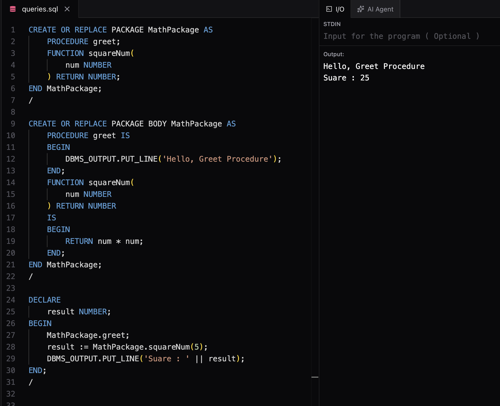

# Packages in PL/SQL

## What is a Package?

A **Package** is a database object that groups logically related PL/SQL objects under one name.

A package can contain:

* Procedures
* Functions
* Variables
* Constants
* Cursors
* Exceptions
* Types

Packages improve code organization, reusability, and maintainability.

---

# Why Use Packages?

### 1. Modularity

Related procedures and functions are grouped together.

Example:

```text
Employee Package
│
├── AddEmployee()
├── UpdateEmployee()
├── DeleteEmployee()
└── GetSalary()
```

---

### 2. Code Reusability

Once created, a package can be called from multiple applications.

---

### 3. Information Hiding

Only the objects declared in the **Package Specification** are visible outside the package.

Objects declared only in the **Package Body** are private.

---

### 4. Better Performance

The entire package is loaded into memory on first use, reducing repeated loading.

---

### 5. Easier Maintenance

Changing only the package body usually does not affect programs that use the package, provided the specification remains unchanged.

---

# Structure of a Package

A package has two parts.

## 1. Package Specification (Public Interface)

Contains declarations of:

* Procedures
* Functions
* Variables
* Constants
* Cursors
* Exceptions

Think of it as the **header** of the package.

Syntax:

```sql
CREATE OR REPLACE PACKAGE package_name AS

    PROCEDURE procedure_name;

    FUNCTION function_name
        RETURN NUMBER;

END package_name;
/
```

---

## 2. Package Body (Implementation)

Contains:

* Implementation of procedures
* Implementation of functions
* Private variables
* Private procedures/functions
* Initialization block

Syntax:

```sql
CREATE OR REPLACE PACKAGE BODY package_name AS

    PROCEDURE procedure_name IS
    BEGIN
        ...
    END;

    FUNCTION function_name
    RETURN NUMBER
    IS
    BEGIN
        RETURN 10;
    END;

END package_name;
/
```

---

# Package Specification vs Package Body

| Package Specification         | Package Body                 |
| ----------------------------- | ---------------------------- |
| Public interface              | Implementation               |
| Declares procedures/functions | Defines procedures/functions |
| Visible outside package       | Hidden implementation        |
| Created first                 | Created after specification  |

---

# Example Package

## Package Specification

```sql
CREATE OR REPLACE PACKAGE MathPackage AS

    PROCEDURE greet;

    FUNCTION squareNum(
        num NUMBER
    ) RETURN NUMBER;

END MathPackage;
/
```

---

## Package Body

```sql
CREATE OR REPLACE PACKAGE BODY MathPackage AS

    PROCEDURE greet IS
    BEGIN
        DBMS_OUTPUT.PUT_LINE('Hello');
    END;

    FUNCTION squareNum(
        num NUMBER
    ) RETURN NUMBER
    IS
    BEGIN
        RETURN num * num;
    END;

END MathPackage;
/
```

---

## Calling Package Members

Procedure

```sql
BEGIN
    MathPackage.greet;
END;
/
```

Function

```sql
DECLARE
    result NUMBER;
BEGIN
    result := MathPackage.squareNum(5);

    DBMS_OUTPUT.PUT_LINE(result);
END;
/
```

Output



---

# Public vs Private Members

### Public

Declared in the specification.

Can be used outside the package.

### Private

Declared only in the body.

Can be used only inside the package.

---

# Package Initialization

A package body can contain an initialization section.

It executes automatically **once per session**, the first time the package is referenced.

Example:

```sql
BEGIN
    DBMS_OUTPUT.PUT_LINE('Package Loaded');
END;
```

---

# Package State

Package variables keep their values for the duration of the database session.

Example:

```sql
counter NUMBER := 0;
```

If a procedure increments `counter`, the updated value remains available during the same session.

---

# SERIALLY_REUSABLE Packages

Normally, package variables remain in memory for the whole session.

Using `PRAGMA SERIALLY_REUSABLE` tells Oracle to release package memory after each call.

Used for:

* Large temporary variables
* Memory optimization

Not commonly used by beginners.

---

# Package Writing Guidelines

* Group related procedures and functions together.
* Keep implementation details private.
* Expose only required procedures/functions.
* Use meaningful package names.
* Use `CREATE OR REPLACE`.
* Keep the specification stable.
* Put business logic inside the package body.

---

# Standard Package

Oracle automatically provides the `STANDARD` package.

It contains commonly used:

* Data types
* Exceptions
* Built-in functions

Examples:

```sql
VARCHAR2
NUMBER
BOOLEAN
NO_DATA_FOUND
ZERO_DIVIDE
```

These are available automatically; you do not need to import the package.

---

# Quick Revision

| Concept                | Purpose                                  |
| ---------------------- | ---------------------------------------- |
| Package                | Groups related PL/SQL objects            |
| Package Specification  | Public declarations                      |
| Package Body           | Implementation                           |
| Public Members         | Accessible outside package               |
| Private Members        | Accessible only inside package           |
| Package Initialization | Runs once when package is first used     |
| Package State          | Variables retain values during a session |
| SERIALLY_REUSABLE      | Releases package memory after each call  |

---

# Questions

### What is a Package?

A collection of related PL/SQL objects stored under one name.

### What are the two parts of a Package?

* Package Specification
* Package Body

### What is the difference between Specification and Body?

* Specification declares public objects.
* Body implements them.

### What is Package Initialization?

Code that runs automatically the first time the package is referenced in a session.

### What is Package State?

Package variables retain their values for the current session.

### Why use Packages?

* Modularity
* Reusability
* Encapsulation
* Better Performance
* Easier Maintenance

---

# My Notes

* Package = Container for related PL/SQL objects.
* Specification = What is available.
* Body = How it works.
* Public objects go in the specification.
* Private objects go only in the body.
* Always create the specification before the body.
* Use packages to organize business logic.
