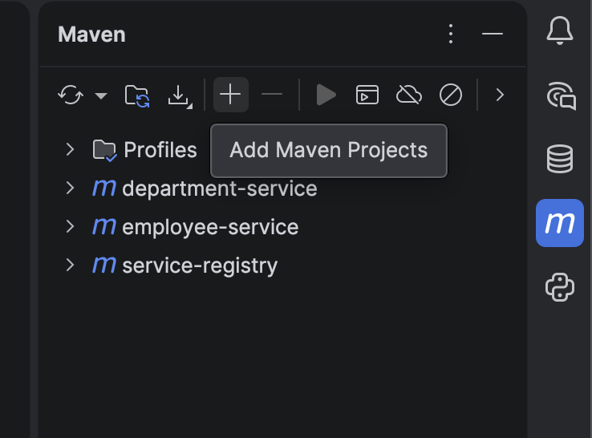

# Micro-services

How to add work with multiple maven projects : 

1. Open Maven window and select **Add Maven Projects**



## Imp Dependencies :

1. **Eureka Server** → Service registry for other services
2. **Eureka Discovery Client** → For services to connect with eureka server

**Dependencies for a service :**


## Steps to make a service registery :

1. Make a project from [start.spring.io](http://start.spring.io) with **Eureka Server** dependency 
    
    
    
2. Add **@EnableEurekaServer** at Application class level
    
    
    
3. Add these values in **application.properties**
    
    ```python
    server.port=8761
    
    # Since this is the registry itself, don't register it as a client
    eureka.client.register-with-eureka=false
    
    # Don't fetch registry information from another Eureka server
    eureka.client.fetch-registry=false
    ```
    
4. Open [http://localhost:8761](http://localhost:8761) it should look like this :
    
    
    

## How to configure Eureka Client for microservices

1. Add these values to **application.properties** :
    
    ```python
    # Eureka client configs
    eureka.client.register-with-eureka=true
    eureka.client.fetch-registry=true
    eureka.client.service-url.defaultZone=http://localhost:8761/eureka/
    ```
    
2. Our `RestTemplate` must be **load-balanced** so it knows to ask Eureka to resolve `DEPARTMENT-SERVICE`.
    
    Create a configuration class :
    
    ```java
    @Configuration
    public class AppConfig {
    
        @Bean
        @LoadBalanced 
        publicRestTemplaterestTemplate() {
    		    returnnewRestTemplate();
        }
        
    }
    ```
    
3. Now we can use any service endpoint like this :
    
    Instead of :
    
    ```java
    Departmentdept=restTemplate.getForObject(
    		"http://localhost:9001/api/departments/"
    		+ emp.getDepartmentId(), Department.class
    );
    ```
    
    we can write :
    
    ```java
    Departmentdept=restTemplate.getForObject(
    		"http://DEPARTMENT-SERVICE/api/departments/" 
    		+ emp.getDepartmentId(), Department.class
    );
    ```